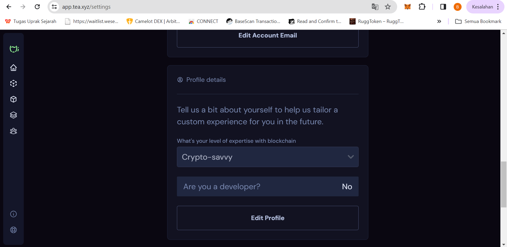
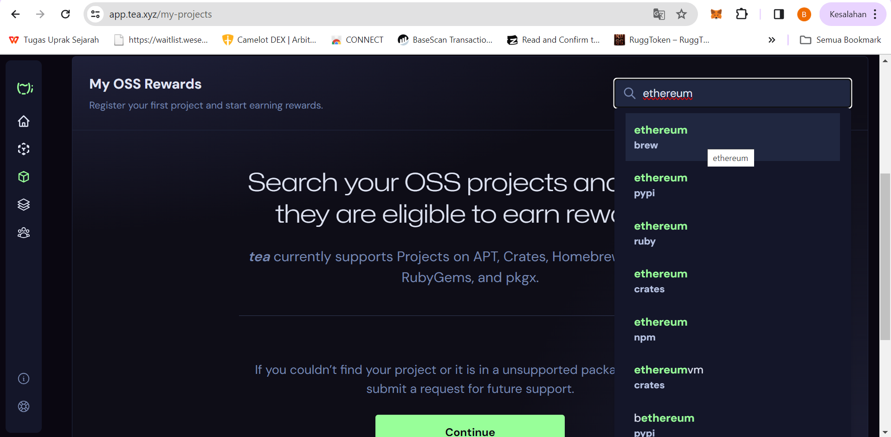
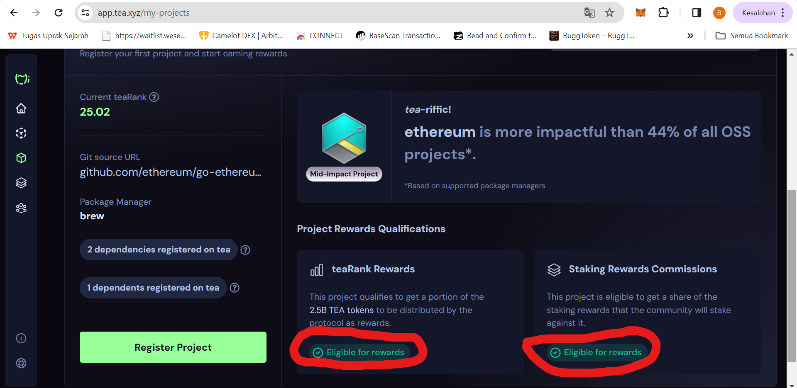
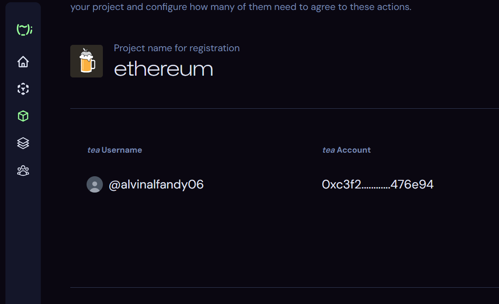
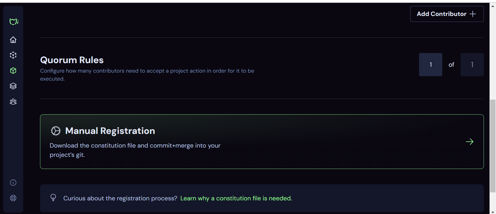
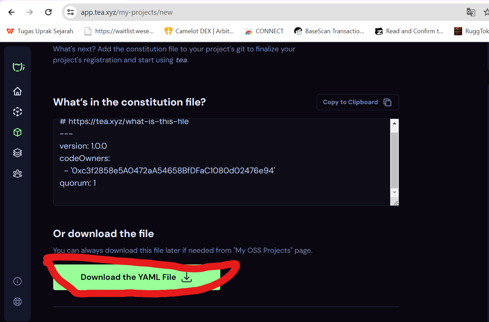
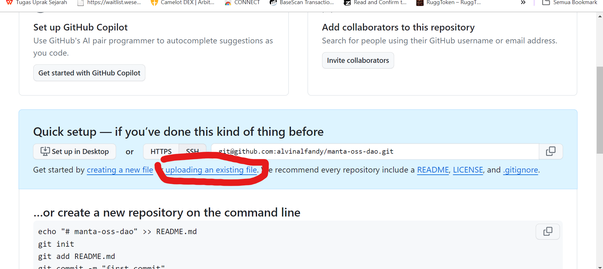
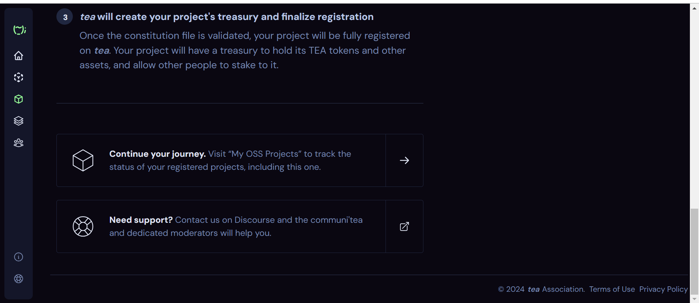
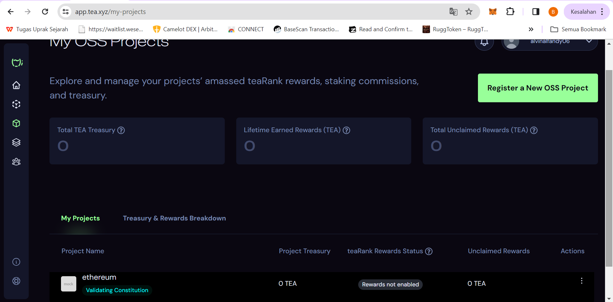

# Tesnet tea protocol tutorial

# How to complete  taks tea tesnet
## Step 1

- It is important to make sure you have registered for the Tesnet whitelist tea protocol
- the first step you have to register using a whitelisted Google account https://app.tea.xyz/
- this is the display when registering successfully

  
- After that, please click on the profile picture then click settings

  

- After that, you connect to GitHub, add email and fill in the profile details

## Step 2
- go to https://app.tea.xyz/my-projects
- then search for projects, for example manta, ethereum, etc

- Projects must be **Eligible for rewards** teaRank Rewards and Staking Rewards Commissions

- Then you click register project

- Then you search for projects again

- After that you will see that your username has been registered and then it's up to you whether you want to add your friend's contributor or not

- Then you click manual register

- Lalu kalian download file yaml

- Lalu menuju ke https://github.com/new
- Buat nama dan decription
- Create reposity
- Lalu upload file yang kalian download tadi

- Done, then just wait for it to be approved,.

- Then you can see the projects that you registered and are waiting for approval, you can also register other projects so that they can be approved quickly. This is important because the next task requires approval. For staking, at least 2 projects must be approved.

## I haven't been approved yet, I will continue this tutorial after I have been approved
